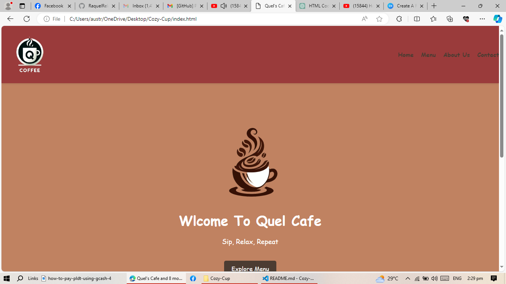
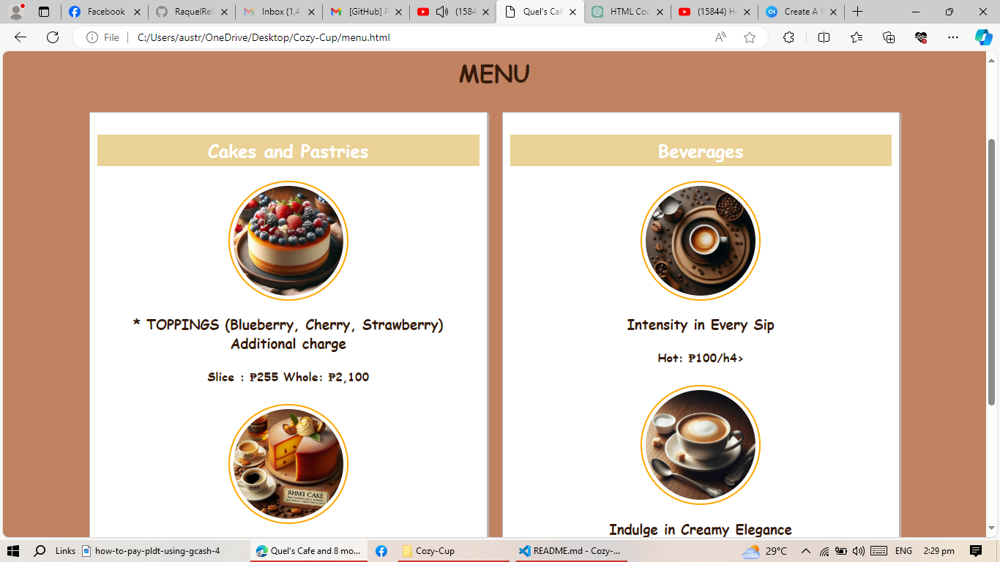
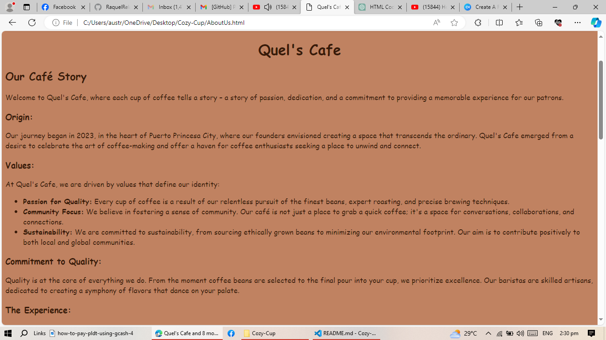
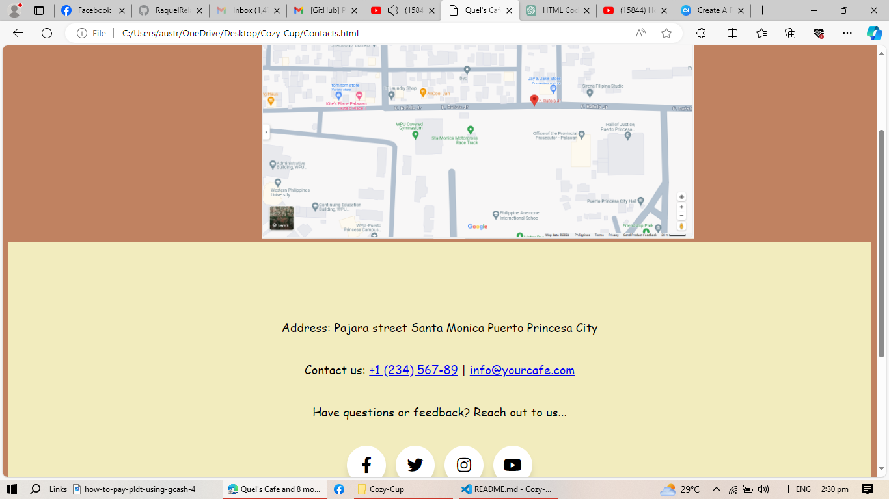

"# Cozy-Cup" 

# Project Description 
"Cozy Cup Cafe is a virtual coffee shop where you can enjoy the cozy atmosphere of a cafe from anywhere. Choose your favorite spot, order from a variety of beverages and snacks, chat with friends or make new ones, and even find a quiet workspace to get things done. It's the perfect place to relax, socialize, or focus, all from the comfort of your own home."

## Features
* Virtual Cafe Environment: Immerse yourself in the ambiance of a cozy cafe with soothing background noise and comfortable seating.
* Menu Options: Choose from a variety of beverages and snacks available on the virtual menu.

### Screen Captures

"This first picture shows the homepage of my website."

"The second picture shows the menu available in Quel's Cafe."

"And the 3rd picture shows the history of my cafe, its origin, values and many more."

"This last picture shows the address of my cafe."

#### About The Athours

Name: Raquel Relata
Email: raquelrelata18@gmail.com

